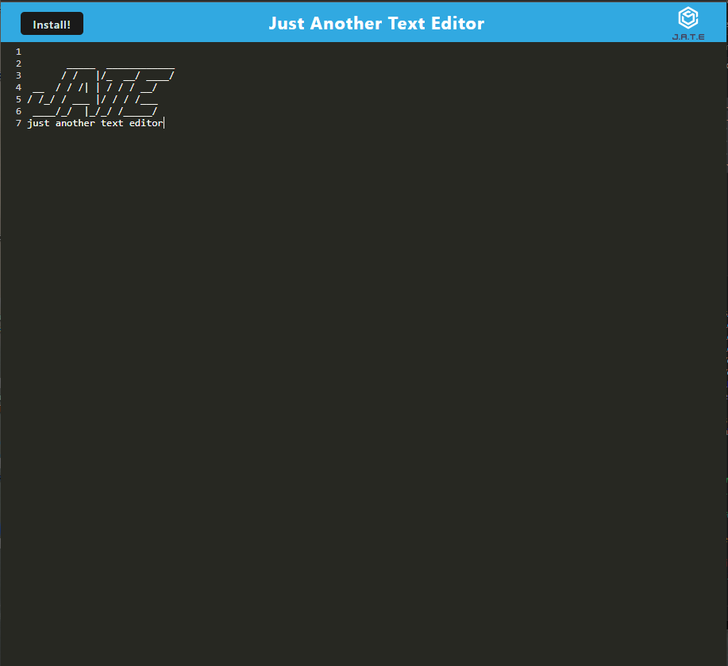

# JUST ANOTHER TEXT EDITOR
  
## Description:
  This is a text editor. It is accessible through the browser and/or locally; users may access entered text both on and offline.
  
## Table of Contents:
  <ol>
    <li><a href="#description">Description</a>
    <li><a href="#preview">Preview</a>
    <li><a href="#license">License</a>
    <li><a href="#techused">Technology/Resources Used</a>
    <li><a href="#contact">Contact Me</a>
  </ol>

## Preview:
  <a href="https://text-editor-hw-019-ab8c4b751f48.herokuapp.com/">Deployment</a>
  

## License:
  MIT License

## Technology/Resources Used:
  - Node.js
  - Express.js
  - Webpack
  - <a href="https://web.dev/codelab-make-installable/">Installation</a>
  - <a href="https://stackoverflow.com/questions/53942876/how-do-i-fingerprint-images-and-other-static-assets-in-ionic-for-cache-busting">Fingerprints in Webpack</a>
  
## Questions:
  For any additional questions, please contact me! You can reach me via:
  <ul>
    <li> Github: <a href="https://github.com/hanwol525">hanwol525</a>
    <li> Email: <a href="mailto:hannahwolfson05@gmail.com">hannahwolfson05@gmail.com</a>
  </ul>
